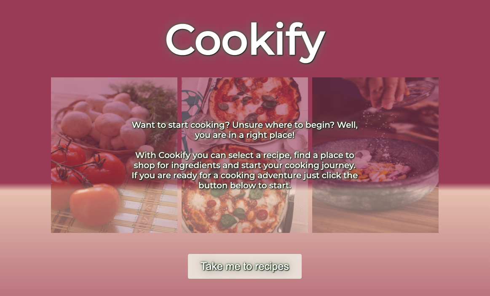
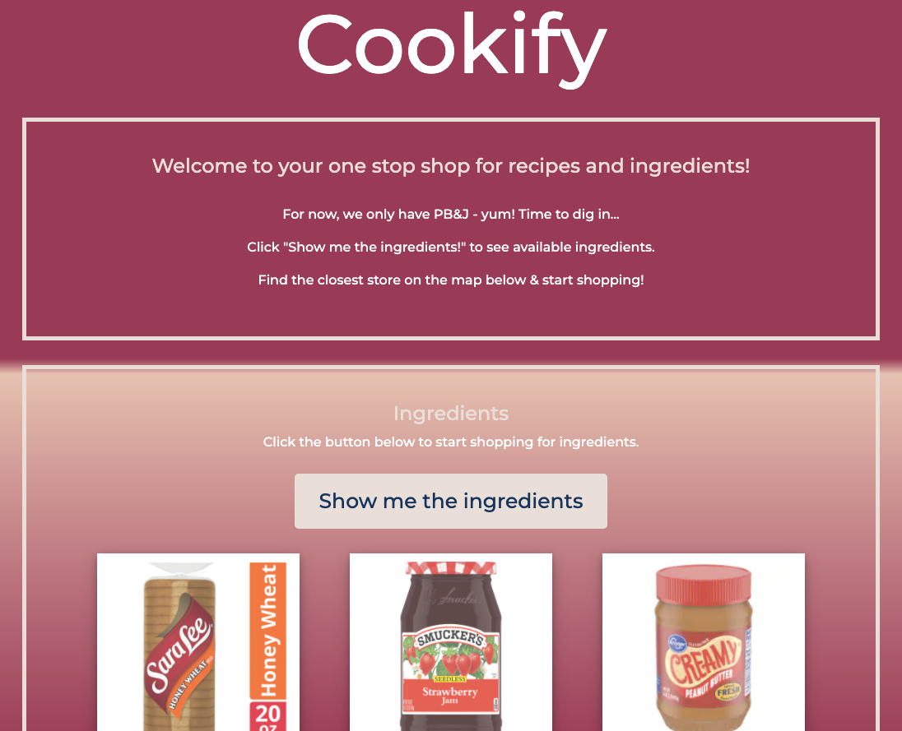

# Cookify - one stop shop for your cooking needs!

## IMPORTANT! 
Currently the application encounters CORS issue when talking to Kroger API. We are working to mitigate the issue. Meanwhile, to be able to use the web page locally please follow instructions below for your default browser: 
- Chrome: Please install the following browser extension: [Cross-domain-cors](https://chrome.google.com/webstore/detail/cross-domain-cors/mjhpgnbimicffchbodmgfnemoghjakai).
- Firefox: Please install the followig browser extension: [Cors-everywhere](https://addons.mozilla.org/en-US/firefox/addon/cors-everywhere/?utm_source=addons.mozilla.org&utm_medium=referral&utm_content=search).
- Safari: Please disable the Access-Control-Allow-Origin in Developer settings. 

## Description
> Everyone gets hungry, but not everyone knows what they want to eat.
> Sometimes you just want to cook something but again, where do you start?
> Well, if you are unsure where to begin, then we can help. 
> 
> This application is intended to do all the legwork for you. All you have to do is pick a recipe and it will find the closest store with the ingredients you need to start your > cooking adventure.
> 
> To get started just click on the “Take me to the recipes!” botton
> Then select a recipe (Sorry, for now we only have PBJ).
> Click a "Start" button to see where you can find the ingredients throughout store of your choice.
> Select store closest to you on a map below.
> & shopping for your ingredients!

## Screenshot(s)




## User Story
```
As a hungry user
I want to be able to figure out what to eat. 
I want to see a visually appealing web application. 
Considering that I am hungry
I want to be able to easily navigate web application by following app instructions. 
I want to see a recipe's list of the ingredients and lastly 
I want the web application to show me where I can find ingredients for a delicious recipe of my choice.
```

## Acceptance Criteria
```
Given that I am indecisive about what I want to eat, or I am new to cooking and don't know where to start, or I am very hungry and I need a quick nutricious 'fix'

When I navigate to Cookify 
Then I am excited to start my cooking journey.

When I start on my cooking journey 
Then I am able to select a recipe (currently only a single recipe is available).

When I select a recipe (currently only a single recipe is available)
Then it displays the ingredient list.

When the ingredient list is displayed
Then I can see each ingredient details, such as product title and where (currently we only provide the product department) I can purchase an items.

When I am ready to shop for ingredients 
Then I can use a store locator map to find a nearby store. 
```

## Technologies used:
```
- HTML, JavaScript, Pure CSS (+ a bit of Bootstrap), jQuery. 
- API's: [Kroger API](https://developer.kroger.com/reference/) and [Google Maps API](https://developers.google.com/maps)
- Draw.io (Wireframes).
```

## Project Links
Git repository: https://github.com/jennyrae818/Project1
Cookify Page: https://jennyrae818.github.io/Project1/
